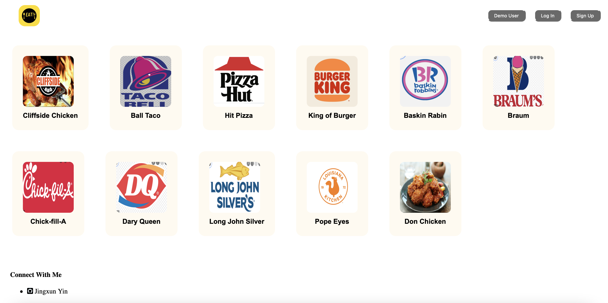
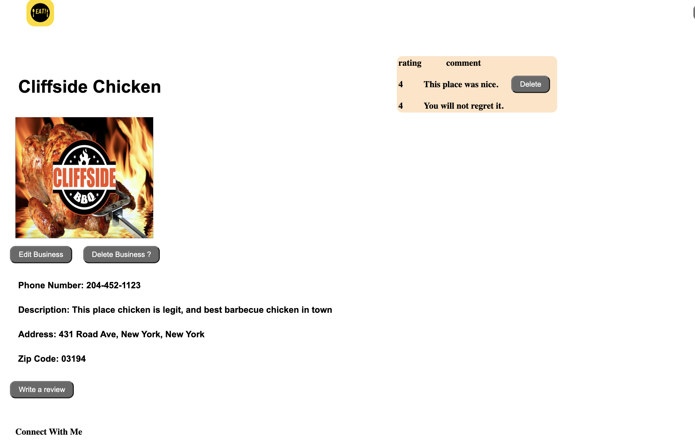
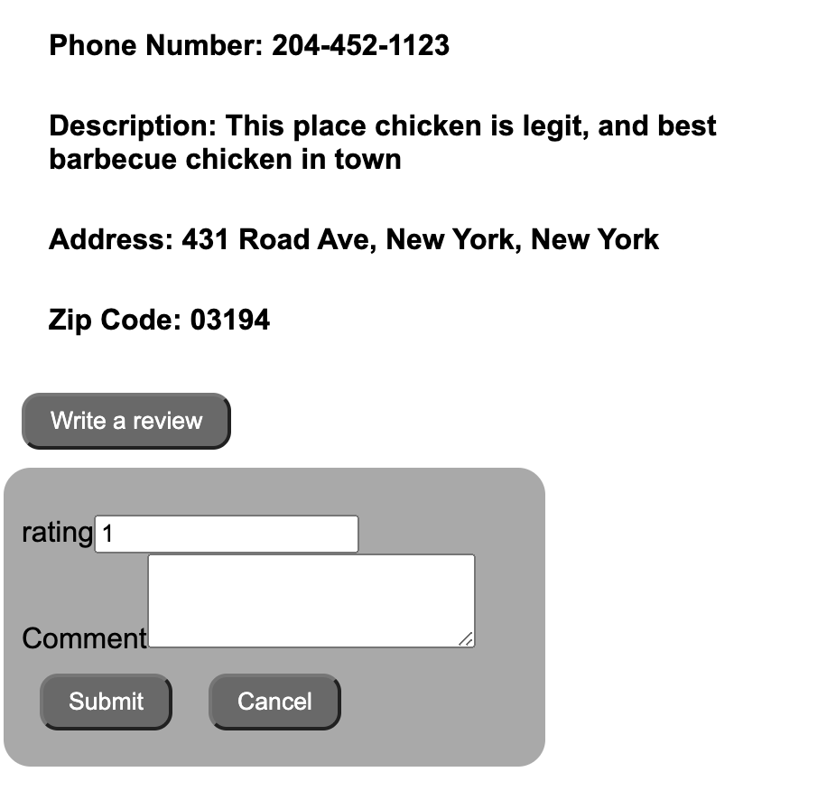
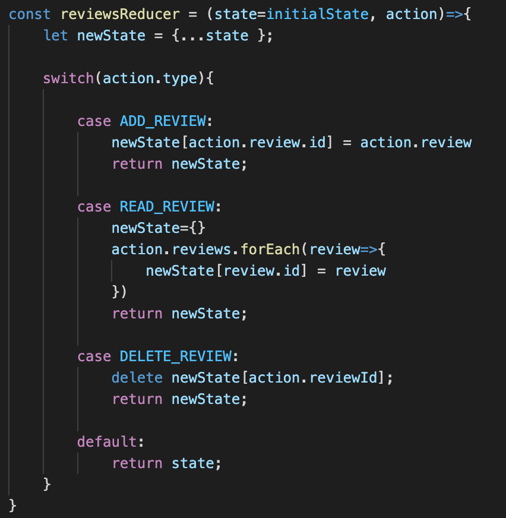
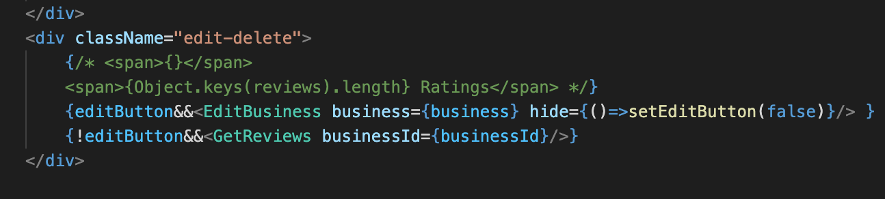
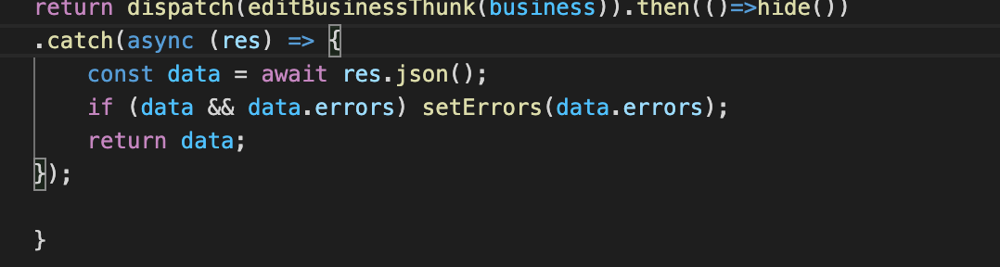

# Eat!

Developer: Jingxun Yin \
Project Repo: [github](https://github.com/jxyin0513/SoloProject)\
Advisor: Rawaha Memon

Please check out my live link [here](https://yelpsoloproject.herokuapp.com)

Eat! is clone of website Yelp, which provide reviews about businesses, but I narrow it down to only for food places.
I used React to render in frontend, and Redux for managing data. \


Eat! is multiple page app, but mainly two pages that shows all businesses in the `main` page, and each business in ```/businesses/:businessId``` page.

## Installation Instruction

* Go to project repo, and clone in your local repository.
* Go to each `backend` and `frontend` file and run ```npm install``` to install all dependencies.
* Use ```npx dotenv sequelize db:create``` to create your own data base.
* Run ```npx dotenv sequelize db:migrate``` to migrate your data.
* Run ```npx dotenv sequelize db:seed``` to seed all your data into your data base.
* Make sure you run `npm start` in both of your ends to start your server.

## Links
1. Feature List Document: [Feature List](https://github.com/jxyin0513/SoloProject/wiki/Feature-List)
2. React Component List: [Component](https://github.com/jxyin0513/SoloProject/wiki/Component-List)
3. DataBase Schema: [Data Base](https://github.com/jxyin0513/SoloProject/wiki/DataBase-Schema)
4. Frontend Routes Document: [Front End](https://github.com/jxyin0513/SoloProject/wiki/Frontend-Routes)
5. API routes document: [Backend Routes](https://github.com/jxyin0513/SoloProject/wiki/API-Backend-Documents)
6. Redux Store Tree Document: [Redux](https://github.com/jxyin0513/SoloProject/wiki/State-Shape)

## Site Features

* For any forms that you are submitting, you are checked to have submitted in a correct format by error handler. \
* I used React and express-validator in the backend to check any errors.

### Main Page

1. On the main page, you can see login, logout, signup in the top bar, for the better I recommend to experience this site as demo user.
2. Also, you can see all the businesses that listed on the site.


### Specific Business Page

1. If you click on any one of the businesses in the main page, you will directed to its detail page.
2. You can check each eat's info, and its reviews.


### Edit/Delete Functionality

1. You can edit or delete business page that only you listed in the site.
2. If you lick ```Edit Business``` button, edit form will show up, and you can edit infos of business.
3. If you click ```Delete Business``` button, you will delete your listed business, and back to main page.

### Review Form
 
 1. On each specific business page, you can write a review with a click ```Write a Review ``` button.
 2. Also you can delete review you wrote.

## Technical Difficulties
 1. Figuring out how to build a easy to use and effecient state shape was challenging part. \
  
 2. How to dynamically show and hide forms are also challenging.\
   \
  

## Future Features

1. Search Bar
2. Buttons with slow motion feature.
3. Sign in/sign up with github or other 3rd party account.
4. Reviews page with stars.
